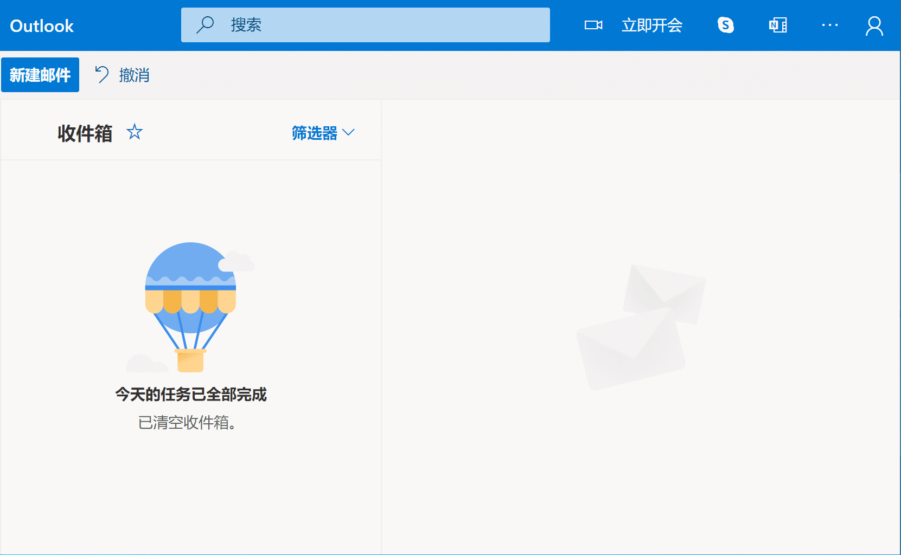

## 使用

- `mv config.js.example config.js` 重命名 example 配置并进行对应修改；
- `npm install` Or `yarn` 安装依赖
- `node index.js` 执行脚本





### Read later

默认启用 read later 功能，删除 `config.js` 中 `readLater` 配置即可关闭。

Read later 通过 [Microsoft Graph API](https://docs.microsoft.com/en-us/graph/api/resources/todo-overview?view=graph-rest-1.0) 实现，首次使用需要可能登录 Outlook 账号。

Read later 数据保存在 Microsoft To Do，优先保存到 ReadLater （需要手动创建），如果没有则保存到 default list。


### Filter

编辑 `config.js` 的 `filter` 配置fresh（内容时效）、max（单个 feed 源最大数量）。


### crontab

crontab 定时每天早上 8 点定时发送邮件。

- `crontab -e`
- `0 8 * * * cd /path/to/RSSMailer && node index.js`

#### 使用 nvm

使用 nvm 需要新建如下 `run.sh` 脚本。

crontab 配置为： `0 8 * * * cd /path/to/RSSMailer && ./run.sh`。
```
#!/bin/sh

export NVM_DIR="$([ -z "${XDG_CONFIG_HOME-}" ] && printf %s "${HOME}/.nvm" || printf %s "${XDG_CONFIG_HOME}/nvm")"
[ -s "$NVM_DIR/nvm.sh" ] && \. "$NVM_DIR/nvm.sh"

node index.js
```
